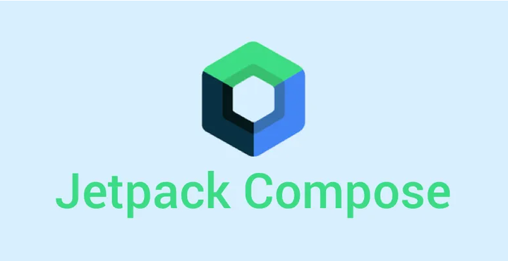

# 课程介绍

在本课程中，您将学习使用 Jetpack Compose 构建 Android 应用的基础知识。

Jetpack Compose 是用于构建 Android 应用的全新界面工具包。

在这个过程中，您将开发一些应用，为成为一名 Android 开发者奠定基础。

||
|:---:|
| Android 之 Compose 开发基础 [课程链接](https://developer.android.google.cn/courses/android-basics-compose/course?hl=zh-cn) |

# 课程资源

使用下面的链接访问课程资源。
- [课件下载](https://docs.qq.com/s/9ciGd-kKPqji-7oXgP7L8W) 下载课程的ppt课件。
- [Kotlin Playground](https://developer.android.google.cn/training/kotlinplayground) 基于网页的Kotlin语言编译与运行环境。
- [Jetpack Compose](https://developer.android.com/develop/ui/compose) 用于构建原生 Android 界面的新工具包。

# 课程作业

## Lab 1 (2025年3月3日~3月9日)
> Unit1: Pathway1
> - 在线课程: [Introduction to programming in Kotlin](https://developer.android.google.cn/courses/pathways/android-basics-compose-unit-1-pathway-1)
> - 作业提交: [Screenshots of Codelabs](https://docs.qq.com/form/page/DYmVaZ2RJWGxNQUtu)
> 
> Unit1: Pathway2
> - 在线课程: [Setup Android Studio](https://developer.android.google.cn/courses/pathways/android-basics-compose-unit-1-pathway-2)
> - 作业提交: [Screenshots of Codelabs](https://docs.qq.com/form/page/DYmJtT21xZm9VS011)
> 
> Unit1: Pathway3
> - 在线课程: [Build a basic layout](https://developer.android.google.cn/courses/pathways/android-basics-compose-unit-1-pathway-3)
> - 作业提交: [Screenshots of Codelabs](https://docs.qq.com/form/page/DYmtDZWR0c3ZnbndK)

## Lab 2 (2025年3月10日~3月16日)
> Unit2: Pathway1
> - 在线课程: [Kotlin fundamentals](https://developer.android.google.cn/courses/pathways/android-basics-compose-unit-2-pathway-1)
> - 作业提交: [Screenshots of Codelabs](https://docs.qq.com/form/page/DYm9YQm5YdnVmem5E)
>